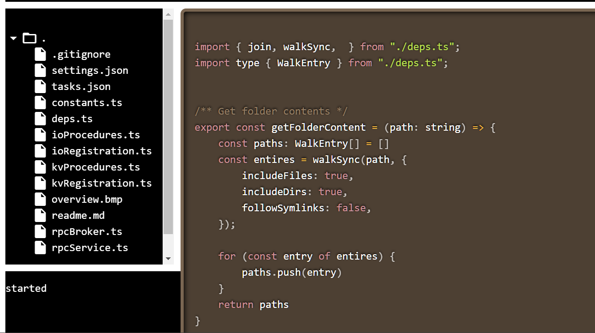
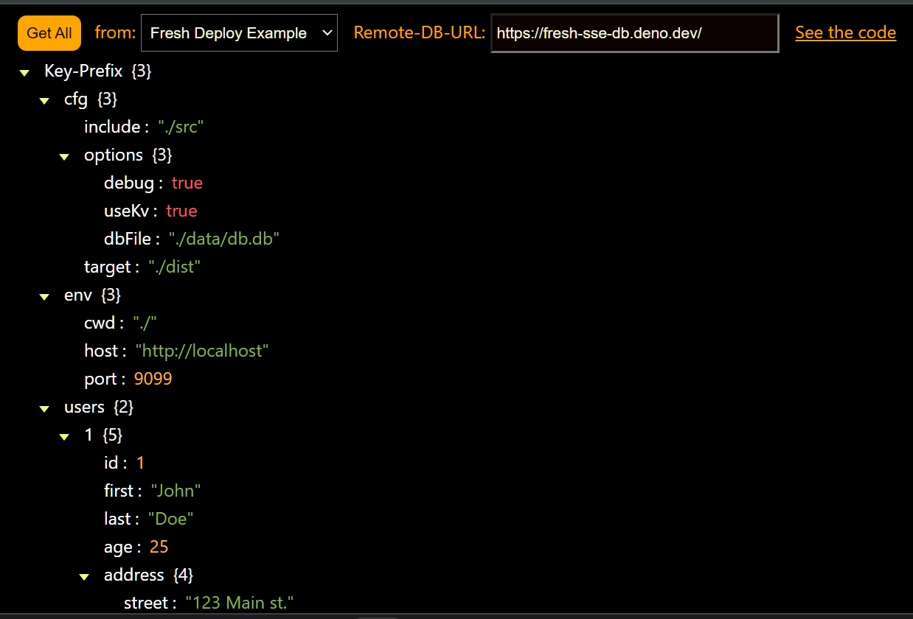
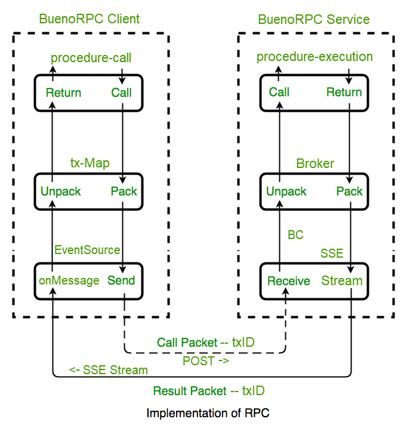

# BuenoRPC Client

This client library implements asynchronous tranactions to a remote BuenoRPC broker service.    
It implements strongly-typed transaction-based Remote Procedure Calls.    
The services provided include:
  - Deno-Kv remote procedures - CRUD + lists, bulk load/delete, 
  - FileIO remote procedures - get-all, get-content, save-content
  - Relay - a generic streaming pubsub service - chat, games, etc.
  - _WIP - Dafka -  a Kafka Clone using Deno-KV_ - Q2-2024

## Example Client Usage
## FileTree example -- https://github.com/nhrones/File-Tree
    

The FileTree app (shown above) exersizes the BuenoRPC remote fileIO procedures.    
This browser app makes calls to get file names and file content from the BuenoRPC broker.    
The file name data returned is then loaded in a TreeView UI.    
Selecting an item in the TreeView will request its content from the BuenoRPC broker.    
Any text content will then be presented in the text presentation control.    

## Kv TreeView example -- https://github.com/nhrones/KvRPC_TreeClient


The Kv-TreeView example app, exersizes the `Deno-Kv remote procedures`.    
It initially makes a call to get all records from the target remote KvDB     
    (see the **_Fresh Deploy_Example_** data above).    
The kv-records returned are then loaded in a treeview UI.     
This tree decomposes Kv-Multipart keys into a heirarchy.  

# RPC
All of the above is accomplished by using Remote Procedure Call transactions - RPC.     

    


Please see: https://github.com/nhrones/BuenoRPC

## Bueno-RPC flow
You can think of Bueno-RPC as a transaction-based request/response communication system.    
We have a client asking a server to process some input and eventually return the output in a streamed response (SSE).     
This all happens as a **_single asynchronous transaction_**:    
  - The client sends a request which is placed in a requestMap with a unique transaction ID (txID). 
  - This immediately returns a requestPromise to the client, leaving it unblocked.
  - The txID is used by both the client and the server to complete the transaction.    
  - Eventually, the server will process the request and stream a response message to the client.
  - All responses from the server are strongly-typed, and will contain the original txID. 
  - The request and response are matched on the client side by looking up the txID in the requestMap.
  - The requestPromise for this txID is either resolved or rejected based on the response.
  - The calling method will then, execute its promise callback, handling any transaction rollback required.  

  ```ts
  // Example
    import { rpcRequest } from './mod.js'
     // rpcRequest returns a promise
     rpcRequest({ procedure: 'DO_SOMETHING', params: someValue(s) })
         .then ((value) => {
             log('got a result from RPC ', value)
             useIt(value);
         }).catch((e) => {
            log(e) // roll-back?
         })
     }
  ```